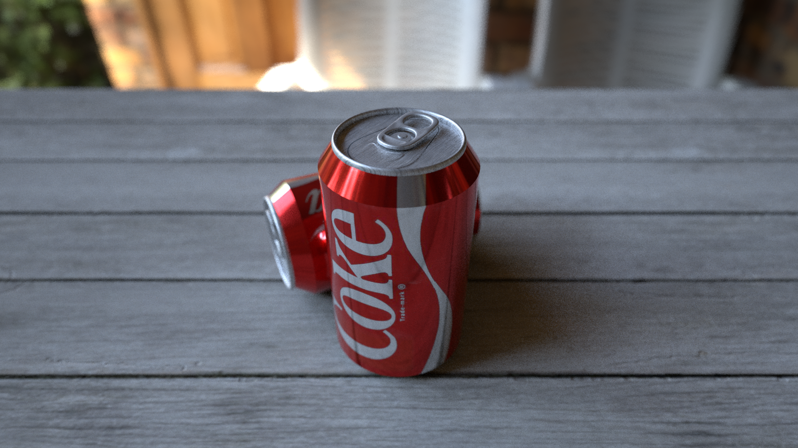
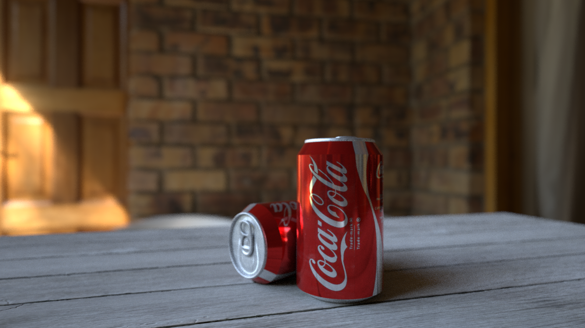

# Renderman_Coke
The aim of this project was to model believable watches and render it with proper shading and lighting according to reference.

   
  

## Requirements:

- RenderManProServer 22.0 or above (https://renderman.pixar.com)
- Python 2.7 (https://www.python.org)

## Running the system:

To launch the program navigate with usage terminal to the directory with downloaded repository and execute command:

```sh
python Scene.py
python Scene2.py
```
## Repository Structure

- *Common*. This floder contains rib archives, which are used in the rendered scene.

- *ObjFiles*.  This floder contains Maya files, from which were cerated rib archives. Moreover, this folder contains Python Renderman scripts which are responsible just for modeling watches geometry.

- *Reference*. This folder contains set of reference photo images of real watches. At the same time, some of this pictures were used as a base for texturing.

- *Shaders*. This folder contains all OSL shaders, which were used for a final shading. 

- *Texturing*. This folder contains both original (jpg, png or exr) and converted (tx) images, which were used for texturing. Moreover, this folder contains HDRI, which was used for lighting.  

